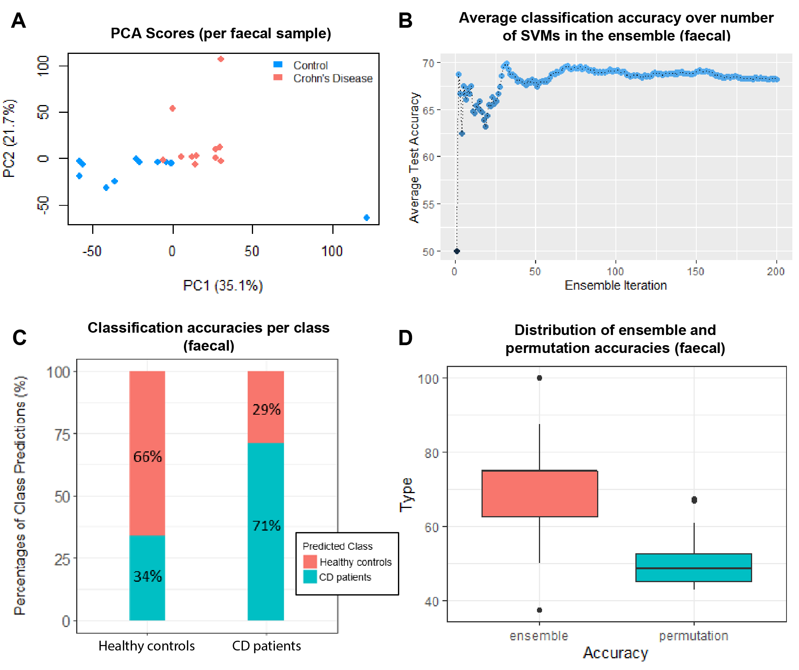

# ML-for-crohns-disease-cw
As part of my MSc Bioinformatics coursework, I used machine learning to rank sample types based on their usefulness in diagnosing Crohn's Disease (CD). This was achieved by building, testing and evaluating the classification models using the `classyfire` (v0.1-2) R package, and determining which samples had the highest classification accuracy in correctly identifying CD samples against healthy controls. This repository contains the R code and resulting output of this analysis.

## Dataset used
* The dataset analysed contained GC-MS data, collected from patients diagnosed with three different gut diseases (IBS, ulcerative colitis and CD), and healthy controls for each sample type.
* For each patient, spectral data was collected for blood, breath, faeces and urine samples. For this study, GC-MS data of patients diagnosed with CD and healthy controls were used.
* Of the dataset containing CD and healthy control (HC) samples, spectral data was available for blood (32 samples: 14 CD, 18 HC), breath (35 samples: 16 CD, 19 HC), faeces (23 samples: 11 CD, 12 HC) and urine (22 samples: 8 CD, 14 HC).
* Data was exported from Matlab as binary .MAT files, and loaded onto RStudio using the R.matlab (v3.6.2) package.

## Analysis workflow
Data pre-processing:
* PCA was performed to reduce the number of variables and ensure computational speed and efficiency when building and testing the machine learning models. Data was scaled and centred prior to PCA.

Building and testing the classification ensembles:
* The cfBuild() function from the `classyfire` package was run and applied to each sample type, using the data matrices with retained PCs as the inputData, and the disease state of each sample (extracted from the CLASS element of the original sample dataset) as the inputClass.
* The number of ensembles and bootstrap iterations (specified using the bootNum and ensNum arguments, respectively) were initially set at 50, and later increased in intervals of 50 until the optimal number of iterations was determined as 200 for all samples.
* To allow for more accurate
comparisons between samples, the same number of ensemble iterations were used for each sample for downstream analysis. This means if a lower iteration was more appropriate for one sample but not for another sample, and a higher iteration value was appropriate for both samples, the higher iteration value would be taken as the optimum value for downstream analysis.
* 4 CPUs were requested for the cluster and default options were used for all other arguments.

Permutation testing:
* Non-parametric permutation testing was used to determine the statistical significance of the performance of the classification model, using the cfpermute() function within `classyfire`.
* Data matrices with retained PCs were used as the inputData, and the disease state of each sample (extracted from the CLASS element of the original sample dataset) as the inputClass.
* 4 CPUs were requested for the cluster and default options were used for all other arguments.

Statistical analysis:
* Statistics were obtained using functions within `classyfire` to evaluate both the classification ensemble and permutation runs.
* The average test and train accuracy of the ensemble and classifiers of the sample was determined using the getAvgAcc() and getAcc() functions, respectively.
* The overall confusion matrix of the ensemble was obtained using the getConfMatr() function, and the optimal SVM hyperparameters of the classification ensemble was determined using the getOptParam() function.
* To evaluate the permutation runs, average accuracies for each permutation and total execution times were obtained, as well as basic descriptive statistics using the getPerm5Num() function.

Visualisations:
* PCA analysis was visualised using base R plotting functions.
* The trend of test accuracies over ensemble iterations, % classification accuracy and test accuracies in ensemble were visualised using the ggEnsTrend(), ggClassPred() and ggEnsHist() functions within `classyfire`, respectively.
* The fused ensemble and permutation results were visualised using the ggFusedHist() function and further plotted with `ggplot2` (v3.3.2).

## Results summary
The figure below shows the results of faecal samples, which was found to be most useful in diagnosing CD with respect to healthy controls (achieving a classification accuracy of 71%). For the results of the other sample types, refer to the `output` folder.

